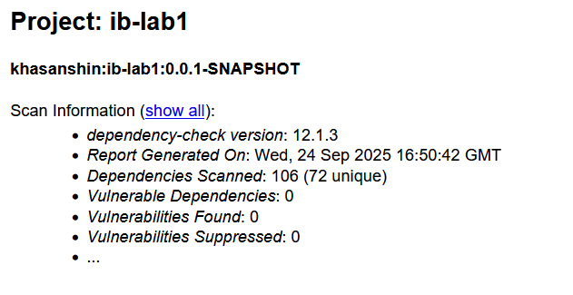

# ib-lab1 — Secure REST API (Spring Boot + JWT)

Учебный проект (Лабораторная №1): Разработка защищенного REST API с
интеграцией в CI/CD

## Содержание
- [Стек](#стек)
- [Быстрый старт (docker-compose)](#быстрый-старт-docker-compose)
- [API](#api)
- [Подробно о мерах защиты](#подробно-о-мерах-защиты)
- [CI/CD и отчёты безопасности](#cicd-и-отчёты-безопасности)
- [Скриншоты отчетов SAST/SCAСкриншоты отчетов SAST/SCA из раздела "Actions" / "CI/CD"](#cкриншоты отчетов SAST/SCA из раздела "Actions" / "CI/CD")
---

## Стек
- Java 21
- Spring Boot 3 (Web, Security, Data JPA)
- PostgreSQL (в docker-compose)
- JWT (JJWT)
- OWASP Java Encoder (экранирование HTML)
- Maven
- SAST: SpotBugs
- SCA: OWASP Dependency-Check
- GitHub Actions

---

## Быстрый старт (docker-compose)

### 1) `.env` в корне
```env
# 32 байта в Base64 (например: openssl rand -base64 32)
JWT_SIGNING_KEY=YOUR_SIGNING_KEY
```

```bash
docker compose up -d --build
docker compose logs -f app
```

Приложение: <http://localhost:8080>

---

## API

### Аутентификация
```
POST /auth/sign-up    { "username": "...", "password": "..." } -> 201 { "token": "..." }
POST /auth/sign-in    { "username": "...", "password": "..." } -> 200 { "token": "..." }
```

### Tasks (защищено JWT)
```
GET    /api/data
GET    /api/data/{id}
POST   /api/data
PUT    /api/data/{id}
DELETE /api/data/{id}
```

### Демонстрация защиты от XSS
```
GET /api/data/{id}/render      -> text/html (экранированный title/description)
```


---

## Подробно о мерах защиты

### Аутентификация и управление сессией
- JWT (HS256); секрет в переменной `JWT_SIGNING_KEY`.
- Stateless: `SessionCreationPolicy.STATELESS`.
- Кастомный фильтр `JwtAuthenticationFilter` валидирует токен и заполняет `SecurityContext`.

### Контроль доступа
- `/auth/**` — публично.
- Остальные эндпоинты — требуется `Authorization: Bearer <token>`.

### Защита от XSS
- Ответы API — JSON, автоматически экранируются при помощи `JacksonHtmlEscapeConfig`
- Для демонстрации XSS есть HTML-рендер `/api/data/{id}/render`:
    - Экранирование пользовательского ввода через **Spring** (`HtmlUtils.htmlEscape`).

### Защита от SQLi
- Spring Data JPA (параметризованные запросы), без конкатенации SQL.
- Валидация DTO аннотациями `jakarta.validation`.

### Хранение паролей
- BCrypt (`BCryptPasswordEncoder`).
---

## CI/CD и отчёты безопасности

- GitHub Actions запускается на каждый push (кроме изменений в README.md).
- Поднимается сервис PostgreSQL.
- SAST: SpotBugs (`target/spotbugsXml.xml`).
- SCA: OWASP Dependency-Check (`target/dependency-check-report.html|json|xml`).

Артефакты с отчётами доступны в разделе Actions → Artifacts.

## Скриншоты отчетов SAST/SCA из раздела "Actions" / "CI/CD"

